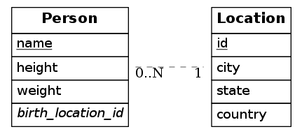

# erd-docker

Dockerfile for running [erd](https://github.com/BurntSushi/erd).

To convert a text file in `.er` format into a `.png` image, you might try:

```
cat simple.er | docker run --rm -i pwarrengrv/erd-docker erd -f png > simple.png
```

Which will produce an image like this:


